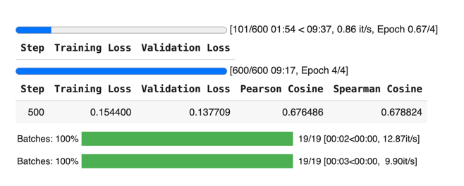
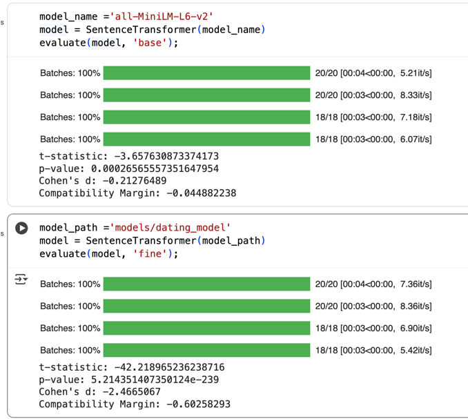

## 🧠 Project Purpose

Fine-tune an embedding model to understand **relationship compatibility** using **contrastive learning** and **synthetic data**. After training, your model should **bring compatible people closer in vector space** and **push incompatible ones apart** — even when their preferences are expressed in different words.

🎯 Core Objectives

| Phase | Goal |
|-------|------|
| Data Generation | Create synthetic pairs labeled similar/dissimilar |
| Contrastive Fine-Tuning | Train with contrastive loss |
| Quantized LoRA | Finetune using 4-bit quantization + LoRA adapters |
| Instructional Alignment | Format prompts as natural instructions for better generalization |
| Evaluation | Use similarity scores, clustering, and recall to benchmark |

# Model fine turing training



# Evaluation Base and fine-tuned model



Base model:
```
{
    "magin": -0.044882237911224365, 
    "p_value": 0.00026565557351647954, 
    "t-statistic": -3.657630873374173, 
    "cohen": -0.2127648890018463
}
```
Fine tuned model:
```
{
    "magin": -0.6025829315185547, 
    "p_value": 5.214351407350124e-239, 
    "t-statistic": -42.218965236238716, 
    "cohen": -2.4665067195892334
}
```